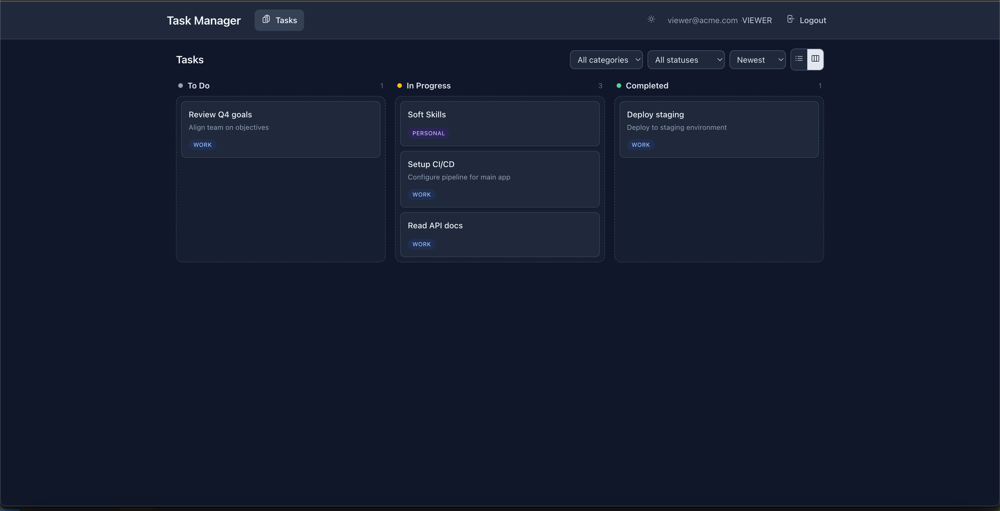
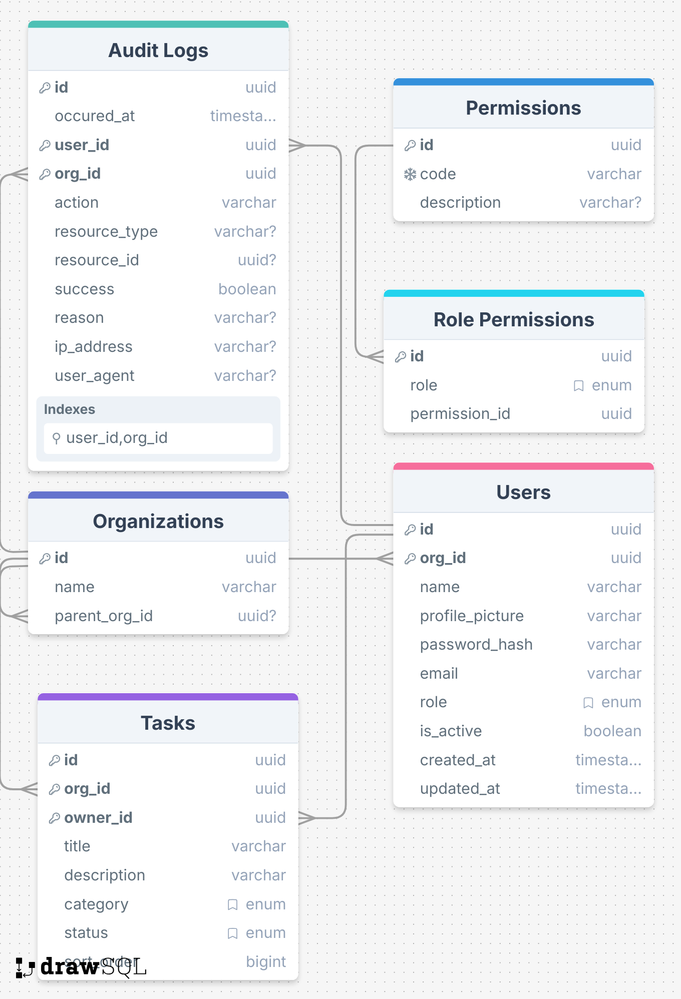

# Task Manager – Nx Monorepo

<!-- fix the interface and create a auth libs, move all interfaces and decorators to libs -->

Full-stack task management application with JWT authentication, role-based access control (RBAC), and organization-scoped data isolation.


## Setup

### Prerequisites

- Node.js >= 18
- npm >= 9

### Install

```bash
  npm install
```

### Environment

The API uses these environment variables (defaults are built-in for development):

| Variable     | Default                   | Description        |
| ------------ | ------------------------- | ------------------ |
| `PORT`       | `3000`                    | API server port    |
| `JWT_SECRET` | `change-me-in-production` | JWT signing secret |

For production, set `JWT_SECRET` to a strong random string. The database is SQLite (file-based, zero config) in development.

### Run

```bash

# Start API (http://localhost:3000)
npx nx serve api

# Start Dashboard (http://localhost:4200)
npx nx serve dashboard

# Run API e2e tests (API must be running)
npx nx e2e api-e2e

# Production build
npx nx build api
npx nx build dashboard
```

---

## Architecture

```
├── apps/
│   ├── api/            NestJS REST API (JWT, RBAC, TypeORM + SQLite)
│   ├── api-e2e/        API end-to-end tests (Jest + Axios)
│   └── dashboard/      Angular 21 SPA (standalone components, signals, Tailwind)
├── libs/
│   └── data/           Shared library (DTOs, enums, RBAC policy, types)
```

**Why Nx monorepo?** Single source of truth for types, enums, and RBAC policy. The `libs/data` library is imported by both `api` and `dashboard`, ensuring DTOs and permission maps are always in sync without package publishing.

**Shared library (`libs/data`) exports:**

- `TaskCategory`, `TaskStatus`, `Role` enums
- `CreateTaskDto`, `UpdateTaskDto` interfaces
- `Permission` enum + `ROLE_PERMISSIONS` map
- `JwtPayload` type

---

## Data Model

> Database schema diagram:
>
> 

---

## Access Control

### Shared RBAC Policy (`libs/data`)

Both API and Dashboard import the same permission map, so definitions are never out of sync:

```typescript
// libs/data/src/lib/rbac/permission.ts
export enum Permission {
  TASK_CREATE = 'TASK_CREATE',
  TASK_READ = 'TASK_READ',
  TASK_UPDATE = 'TASK_UPDATE',
  TASK_DELETE = 'TASK_DELETE',
  AUDIT_READ = 'AUDIT_READ',
  ORG_CREATE = 'ORG_CREATE',
  USER_CREATE = 'USER_CREATE',
}

export const ROLE_PERMISSIONS: Record<Role, Permission[]> = {
  [Role.VIEWER]: [Permission.TASK_READ],
  [Role.ADMIN]: [Permission.TASK_READ, Permission.TASK_CREATE, Permission.TASK_UPDATE, Permission.TASK_DELETE],
  [Role.OWNER]: [Permission.TASK_READ, Permission.TASK_CREATE, Permission.TASK_UPDATE, Permission.TASK_DELETE, Permission.AUDIT_READ, Permission.ORG_CREATE, Permission.USER_CREATE],
};
```

| Permission  | VIEWER | ADMIN | OWNER |
| ----------- | ------ | ----- | ----- |
| TASK_READ   | x      | x     | x     |
| TASK_CREATE |        | x     | x     |
| TASK_UPDATE |        | x     | x     |
| TASK_DELETE |        | x     | x     |
| AUDIT_READ  |        |       | x     |
| ORG_CREATE  |        |       | x     |

---

### API (Backend) — Three-Layer Enforcement

RBAC is enforced at three levels in the API: **Guard**, **Service**, and **Org Scoping**. This defense-in-depth approach ensures security even if one layer is bypassed.

#### 1. Guard Level — Route Protection

The `@RequirePermissions()` decorator attaches required permissions as metadata. `JwtAuthGuard` validates the JWT, then `PermissionsGuard` checks the user's role against the required permissions:

```typescript
// apps/api/src/app/decorators/permissions.decorator.ts
export const RequirePermissions = (...permissions: Permission[]) => SetMetadata(REQUIRED_PERMISSIONS_KEY, permissions);
```

```typescript
// apps/api/src/app/guards/permissions.guard.ts
@Injectable()
export class PermissionsGuard implements CanActivate {
  constructor(private reflector: Reflector) {}

  canActivate(context: ExecutionContext): boolean {
    const requiredPermissions = this.reflector.getAllAndOverride<Permission[]>(REQUIRED_PERMISSIONS_KEY, [context.getHandler(), context.getClass()]);
    if (!requiredPermissions?.length) return true;

    const user = context.switchToHttp().getRequest().user as JwtPayload;
    if (!user?.role) throw new ForbiddenException('Permission missing');

    const allowed = ROLE_PERMISSIONS[user.role] ?? [];
    const missing = requiredPermissions.filter((p) => !allowed.includes(p));
    if (missing.length > 0) throw new ForbiddenException('Permission missing');
    return true;
  }
}
```

Applied on the controller — every route in `TasksController` requires JWT + specific permission:

```typescript
// apps/api/src/app/tasks/tasks.controller.ts
@Controller('tasks')
@UseGuards(JwtAuthGuard, PermissionsGuard)
export class TasksController {

  @Post()
  @RequirePermissions(Permission.TASK_CREATE)
  create(@Req() req: { user: JwtPayload }, @Body() dto: CreateTaskDto) {
    return this.tasksService.create(req.user, dto);
  }

  @Get()
  @RequirePermissions(Permission.TASK_READ)
  findAll(@Req() req: { user: JwtPayload }) { ... }

  @Put(':id')
  @RequirePermissions(Permission.TASK_UPDATE)
  update(@Req() req: { user: JwtPayload }, @Param('id') id: string, @Body() dto: UpdateTaskDto) { ... }

  @Delete(':id')
  @RequirePermissions(Permission.TASK_DELETE)
  remove(@Req() req: { user: JwtPayload }, @Param('id') id: string) { ... }
}
```

#### 2. Service Level — Business Logic Enforcement

Even if guards are bypassed, the service re-checks permissions before executing business logic:

```typescript
// apps/api/src/app/tasks/tasks.service.ts
@Injectable()
export class TasksService {
  hasPermission(user: JwtPayload, permission: Permission): boolean {
    const granted = ROLE_PERMISSIONS[user.role] ?? [];
    return granted.includes(permission);
  }

  assertPermission(user: JwtPayload, permission: Permission): void {
    if (!this.hasPermission(user, permission)) {
      throw new ForbiddenException('Permission missing');
    }
  }

  async create(jwtPayload: JwtPayload, createTaskDto: CreateTaskDto) {
    this.assertPermission(jwtPayload, Permission.TASK_CREATE); // <-- service-level check
    const task = this.tasksRepository.create({
      ...createTaskDto,
      organization: { id: jwtPayload.orgId },
      owner: { id: jwtPayload.sub },
    });
    return this.tasksRepository.save(task);
  }

  async update(jwtPayload: JwtPayload, id: string, updateTaskDto: UpdateTaskDto) {
    this.assertPermission(jwtPayload, Permission.TASK_UPDATE); // <-- service-level check
    // ... find and update task
  }
}
```

#### 3. Org Scoping — Data Isolation

Every database query filters by the user's organization, ensuring users can never access another org's data:

```typescript
// apps/api/src/app/tasks/tasks.service.ts
async findAll(jwtPayload: JwtPayload) {
  this.assertPermission(jwtPayload, Permission.TASK_READ);
  const allowedOrgIds = await this.organizationService.getAllowedOrgIds(jwtPayload.orgId);
  return this.tasksRepository.find({
    where: { organization: { id: In(allowedOrgIds) } }, // <-- org-scoped query
    relations: ['organization', 'owner'],
  });
}
```

---

### Dashboard (Frontend) — UI-Level Gating

Frontend RBAC is **UX only** — it hides actions the user cannot perform. The backend remains the final authority.

#### 1. AuthService — Client-Side Permission Check

Decodes the JWT and checks `ROLE_PERMISSIONS` (same shared map as the API):

```typescript
// apps/dashboard/src/app/core/auth/auth.service.ts
@Injectable({ providedIn: 'root' })
export class AuthService {
  readonly user = computed(() => {
    const t = this.tokenSignal();
    return t ? decodeJwt(t) : null;
  });

  hasPermission(permission: Permission): boolean {
    const u = this.user();
    if (!u) return false;
    const granted = ROLE_PERMISSIONS[u.role] ?? [];
    return granted.includes(permission);
  }
}
```

#### 2. Route Guards — Angular Functional Guards

Routes are protected by `permissionGuard`, which reads required permissions from route data:

```typescript
// apps/dashboard/src/app/core/auth/permission.guard.ts
export const permissionGuard: CanActivateFn = (route) => {
  const auth = inject(AuthService);
  const router = inject(Router);

  if (!auth.isLoggedIn()) return router.createUrlTree(['/login']);

  const permissions = route.data['permissions'] as Permission[];
  if (!permissions?.length) return true;

  const hasAll = permissions.every((p) => auth.hasPermission(p));
  return hasAll ? true : router.createUrlTree(['/forbidden']);
};
```

Applied on routes — each route declares its required permissions:

```typescript
// apps/dashboard/src/app/app.routes.ts
{
  path: 'tasks',
  loadComponent: () => import('./features/tasks/task-list/task-list.component').then(m => m.TaskListComponent),
  canActivate: [permissionGuard],
  data: { permissions: [Permission.TASK_READ] },
},
{
  path: 'tasks/new',
  loadComponent: () => import('./features/tasks/task-form/task-form.component').then(m => m.TaskFormComponent),
  canActivate: [permissionGuard],
  data: { permissions: [Permission.TASK_CREATE] },
},
{
  path: 'audit-log',
  loadComponent: () => import('./features/audit/audit-list/audit-list.component').then(m => m.AuditListComponent),
  canActivate: [permissionGuard],
  data: { permissions: [Permission.AUDIT_READ] },
},
```

#### 3. UI Visibility — Template-Level Gating

Navigation items and action buttons are conditionally rendered based on permissions:

```typescript
// apps/dashboard/src/app/layout/layout.component.ts
export class LayoutComponent {
  auth = inject(AuthService);

  get canReadAudit() {
    return this.auth.hasPermission(Permission.AUDIT_READ);
  }
}
```

```html
<!-- Only OWNER sees the Audit Log link -->
@if (canReadAudit) {
<a routerLink="/audit-log">Audit Log</a>
}
```

#### 4. HTTP Error Interceptor — Graceful Fallback

If a user somehow reaches a forbidden resource, the API returns 401/403 and the interceptor redirects:

```typescript
// apps/dashboard/src/app/core/auth/error.interceptor.ts
export const errorInterceptor: HttpInterceptorFn = (req, next) => {
  const router = inject(Router);
  const auth = inject(AuthService);

  return next(req).pipe(
    catchError((err: HttpErrorResponse) => {
      if (err.status === 401) {
        auth.tokenValue = null;
        router.navigate(['/login']);
      } else if (err.status === 403) {
        router.navigate(['/forbidden']);
      }
      return throwError(() => err);
    }),
  );
};
```

---

### RBAC Flow Summary

```
Request → JwtAuthGuard (validate token)
       → PermissionsGuard (check ROLE_PERMISSIONS[role] vs @RequirePermissions)
       → Service.assertPermission() (defense-in-depth re-check)
       → Org-scoped DB query (data isolation)
       → Response
```

_Backend is the single source of truth. Frontend gating only improves UX._

---

## Organization Scope Design

### Single-Organization Membership

Each user belongs to exactly one organization.

**Tradeoff:**  
Users cannot belong to multiple organizations.

**Rationale:**  
Keeps JWT payload simple and RBAC deterministic.  
Multi-org support would require:

- `user_organizations` join table
- Active org switching
- Role-per-org logic

### Two-Level Organization Hierarchy

Organizations support a parent and direct children (maximum 2-level hierarchy, no deep recursion).

**Tradeoff:**  
Limited flexibility for large enterprise structures.

**Rationale:**  
Requirement specifies max 2 levels.

---

## Rate Limiting

Authentication endpoints are rate limited to mitigate abuse and brute-force attacks.

- **Implemented via:** NestJS throttling middleware

**Why?**

- Prevent brute-force attacks
- Improve production-readiness
- Reduce abuse risk

**Tradeoff:**  
Adds slight request overhead.

## API

> **Postman collection:** [TurboVets Workspace collection](https://naahia-6479.postman.co/workspace/Naahia-Workspace~08336faf-d5a8-413a-8d7b-f2e239a19c9b/collection/30869955-b2de4d80-71c3-4df0-9845-4f22710bcdb1?action=share&creator=30869955&active-environment=30869955-520b5efb-2177-4f81-939c-2048253874d0)

### Endpoints

| Method | Path               | Auth | Permission  | Description             |
| ------ | ------------------ | ---- | ----------- | ----------------------- |
| GET    | /api               | No   | –           | Health check            |
| POST   | /api/auth/register | No   | –           | Register org + owner    |
| POST   | /api/auth/login    | No   | –           | Login, get JWT          |
| GET    | /api/tasks         | JWT  | TASK_READ   | List tasks (org-scoped) |
| GET    | /api/tasks/:id     | JWT  | TASK_READ   | Get single task         |
| POST   | /api/tasks         | JWT  | TASK_CREATE | Create task             |
| PUT    | /api/tasks/:id     | JWT  | TASK_UPDATE | Update task             |
| DELETE | /api/tasks/:id     | JWT  | TASK_DELETE | Delete task             |
| GET    | /api/audits-logs   | JWT  | AUDIT_READ  | List audit logs         |

### Sample requests

**Register**

```bash
curl -X POST http://localhost:3000/api/auth/register \
  -H "Content-Type: application/json" \
  -d '{"org_name": "Acme Inc", "email": "admin@acme.com", "password": "Secret123"}'
# -> { "accessToken": "eyJhbG..." }
```

**Login**

```bash
curl -X POST http://localhost:3000/api/auth/login \
  -H "Content-Type: application/json" \
  -d '{"email": "admin@acme.com", "password": "Secret123"}'
# -> { "accessToken": "eyJhbG..." }
```

**Create task** (requires Bearer token)

```bash
curl -X POST http://localhost:3000/api/tasks \
  -H "Authorization: Bearer <token>" \
  -H "Content-Type: application/json" \
  -d '{"title": "Ship feature", "category": "WORK", "status": "TODO"}'
# -> { "id": "uuid", "title": "Ship feature", "category": "WORK", "status": "TODO", ... }
```

**Update task status** (drag-and-drop uses this)

```bash
curl -X PUT http://localhost:3000/api/tasks/<id> \
  -H "Authorization: Bearer <token>" \
  -H "Content-Type: application/json" \
  -d '{"status": "COMPLETED"}'
```

---

## Tradeoffs & Solutions

| Decision                           | Tradeoff                    | Rationale                                                         |
| ---------------------------------- | --------------------------- | ----------------------------------------------------------------- |
| File-based RBAC                    | Cannot add roles at runtime | Fixed role set; avoids DB joins; shared via `libs/data`           |
| Single-org membership              | No multi-org switching      | Simplifies JWT and authorization                                  |
| Two-level hierarchy                | No deep nesting             | Matches requirement;                                              |
| SQLite in dev                      | Not production-grade        | Zero config; easily swappable with Postgres                       |
| Client-side JWT decode             | Payload visible             | Payload contains non-sensitive info; backend enforces permissions |
| Authorization in guards + services | Slight duplication          | Defense in depth                                                  |
| Logging successful audit actions   | Larger audit table          | Enables full traceability                                         |
| Rate limiting enabled              | Slight overhead             | Protects auth endpoints                                           |
| Client-side filtering              | Doesn't scale               | Acceptable for scope; can move server-side                        |

---

## Future Considerations

- **Organization invites** – allow owners/admins to invite users via a unique invite code or shareable link, removing the need to manually create accounts per org
- **Multi-org membership** – currently each user belongs to a single organization; extend to a many-to-many relationship (`user_organizations` join table) so users can switch between orgs
- **PostgreSQL** – replace SQLite with Postgres for production (connection pooling, concurrent writes, proper JSON/UUID types). TypeORM config swap only, no schema changes required
- **Profile picture upload** – support image upload during registration or in a profile settings page, storing files in S3/Cloud Storage and saving the URL to `users.profile_picture_url` (column already exists)
- **Pagination** - include pagination for the audit logs.
